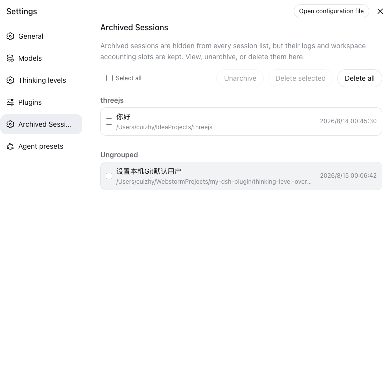

# session-archive-manager

Manage archived sessions from DeepSeek Harness Settings: view, unarchive, delete, batch delete, or delete all — the archived-session surface the harness itself does not ship.

> 中文：[README.zh.md](README.zh.md)

## Features

- **View** every archived session in Settings — title, workspace, working directory, and last-updated time — even though the harness hides archived sessions from every grouping surface.
- **Unarchive** one session or a selection: each reappears in its retained workspace accounting slot.
- **Delete** one session, **delete a selection**, or **delete all** archived sessions at once, each with an inline confirmation.
- **Live refresh**: the list follows the host's archive set and session summaries while the page is open; actions reflect immediately through the runtime stores.
- **Capability gate**: on a harness without the core APIs the page degrades to a read-only list with a clear upgrade notice instead of broken buttons.

## How it works

The plugin is UI-only. It derives the archived-session rows by cross-referencing the live `workspaces.list` archive set with `sessions.list` summaries, and every action rides the core `workspace.unarchiveSession` / `workspace.deleteSession` RPCs through the `workspaces` runtime service. Nothing polls, and nothing runs on the host side beyond the RPCs themselves.

## Screenshot



The **Archived Sessions** entry sits in Settings right after **Plugins**. Rows are grouped by workspace with a small group title; sessions no workspace accounts fall into the **Ungrouped** bucket at the end. Batch actions — unarchive, delete selected, delete all — live in the toolbar above the list.

## Requirements

The harness does not ship the unarchive/delete APIs yet (no upstream release channel), so **a source checkout of deepseek-harness with the bundled patch applied is required today**. On a harness without the APIs the settings page shows the archive list read-only with an upgrade notice.

## Install

**The plugin itself never needs to be built.** The repository ships the prebuilt host entry and browser bundle in `lib/` (committed), so installing is a clone/pull plus one CLI command — no `pnpm install` in this repo, no `prepare` scripts, no `allowBuilds` approvals. The only build in the whole flow is the harness's own, for the core patch in step 1.

### 1. Patch the harness core

From this repository, against your deepseek-harness checkout (pinned to base commit `47f943859b`; a different commit may need `git apply -3`):

```sh
node scripts/apply-patch.mjs /path/to/deepseek-harness
cd /path/to/deepseek-harness
npm run build:lib:host
npm run build:lib:client
```

The patch (`patches/dsh-core-unarchive-delete.patch`) adds the two workspace RPCs, the session-persistence delete seam with JSONL/SQLite backends, the client-runtime actions, and their tests. It is additive only — no existing behavior changes.

### 2. Install the plugin (no build needed)

**From a local clone (recommended for iterating)** — installs as a link: the committed `lib/` is served as-is, and `git pull` in the clone updates the plugin without any build:

```sh
git clone https://github.com/my-dsh-plugin/session-archive-manager.git
pnpm dsh plugin add --profile web /path/to/session-archive-manager
```

(`dsh` CLI from your harness checkout; set `DSH_HOME` to your harness home if it is not the default `~/.dsh`.)

**Straight from git** — pnpm fetches the repository and uses the committed `lib/`; no build script runs:

```sh
pnpm dsh plugin add --profile web github:my-dsh-plugin/session-archive-manager
```

`dsh plugin add` adds the dependency and reconciles the `dsh.profile.bundles` layer list. The manual equivalent is editing the profile's `package.json`:

```json
"dependencies": {
  "dsh-session-archive-manager": "link:/path/to/session-archive-manager"
}
```

```json
"dsh": {
  "profile": {
    "bundles": ["@deepseek-ai/dsh-base", "@deepseek-ai/dsh-web-app", "dsh-session-archive-manager"]
  }
}
```

then `pnpm install` inside the profile directory.

### 3. Restart and verify

Restart the harness (`npx @deepseek-ai/dsh web` or however you launch it). The **Archived Sessions** entry appears in Settings, after Plugins.

- The page shows the read-only notice → the core patch is not active in the running build (check the rebuild step, or that the old process was fully stopped).
- The menu entry is missing entirely → the plugin is not in the running profile's bundle layer (re-run `dsh plugin add`, verify the bundles list).

### DeepSeek Harness Desktop — one-shot install

Desktop users need neither a harness checkout nor the core patch: the desktop harness is
built from the my-dsh-plugin fork, which already carries the archive/unarchive/delete core
support. Run this once in a **normal terminal** (not inside the app's own harness shell —
the app bundle and app-data dir are sandboxed/read-only from there, especially on macOS):

```sh
bash <(curl -Ls https://raw.githubusercontent.com/my-dsh-plugin/session-archive-manager/main/scripts/install-desktop.sh) --restart
```

The script is idempotent: pulls the plugin from GitHub (prebuilt `lib/`, nothing to build),
appends `"session-archive-manager"` to the embedded harness `WEB_SETTINGS_NAMESPACES`
allowlist if missing, installs it into the desktop web profile, registers the bundle, and
restarts the app (`--restart`). The **Archived Sessions** entry then appears in Settings.
Overrides: `DSH_DESKTOP_APP`, `DSH_DESKTOP_HOME`, `DSH_SKILL_SOURCE_DIR`.

> End users of a released desktop build need no manual steps — upgrade and restart; the
> plugin is seeded and the allowlist is already in the shipped harness.

## Maintenance

The patch is pinned to a harness base commit, so it drifts as the harness upstream moves. When your checkout updates, regenerate and re-verify the patch before committing:

```sh
node scripts/regenerate-patch.mjs /path/to/deepseek-harness
git -C /path/to/deepseek-harness stash
git -C /path/to/deepseek-harness apply --check /path/to/session-archive-manager/patches/dsh-core-unarchive-delete.patch
git -C /path/to/deepseek-harness stash pop
```

The regeneration covers only this plugin's core extension (unrelated local changes are excluded automatically). Bump the base via `DSH_PATCH_BASE=<commit>` when the extension is re-based onto a newer upstream commit.

## Development

Building is only for **changing the plugin itself** — consumers never build. It requires the sibling `deepseek-harness` checkout (`../deepseek-harness`) because the client bundle is produced by the shared harness preset:

```sh
pnpm install
pnpm test       # vitest: controller and row-assembly suites
pnpm typecheck  # tsc -b over src + tests against the harness checkout
pnpm build      # tsc declarations + tsdown host + client bundle into lib/
```

After a build, commit `lib/` so consumers keep getting the prebuilt artifacts (a `git pull` is all a link-installed profile needs to pick up a change).

## Known Limitations and Deferred Work

- Deleting a session refuses only while its agent is running a turn; stop the turn first, then delete.
- Attachments written by a deleted session are not garbage-collected; they remain in the attachment store, which is content-addressed and shared by log export.
- The session-search index drops a deleted session on its next reconciliation; the running web client's sidebar refreshes from its own stores and may show the row until the next list refresh.

## License

Apache-2.0
