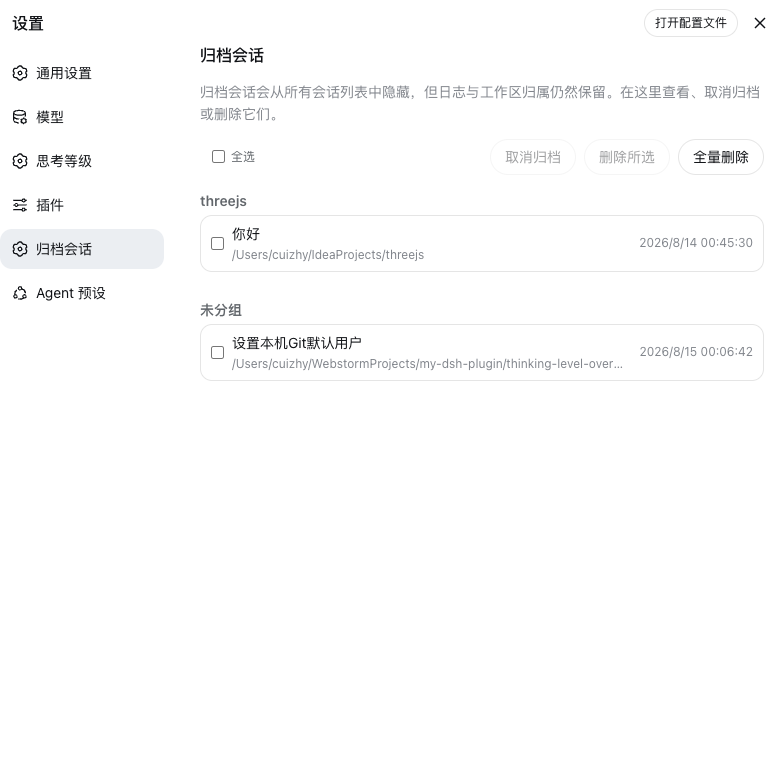

# session-archive-manager

在 DeepSeek Harness 设置页查看归档会话，支持取消归档、删除、批量删除与全量删除 —— 补上 Harness 本身缺失的归档会话管理入口。

> English: [README.md](README.md)

## 功能

- **查看**全部归档会话：标题、工作区、工作目录与最近更新时间。归档会话会被所有会话列表隐藏，只有这里能看到。
- **取消归档**单个或选中的会话：归档时保留的工作区归属槽位会被恢复，会话重新出现在原有位置。
- **删除**单个会话、**删除所选**或**全量删除**全部归档会话，均有内联确认，防止误删。
- **实时刷新**：列表跟随宿主的归档集合与会话摘要实时更新；操作通过运行时 store 即时生效。
- **能力检测**：在缺少核心 API 的 Harness 上，页面自动降级为只读列表并给出明确的升级提示，而不是出现点了报错的按钮。

## 工作原理

本插件只提供界面。归档行由实时的 `workspaces.list` 归档集合与 `sessions.list` 摘要交叉派生而来，所有操作都通过 `workspaces` 运行时服务调用核心的 `workspace.unarchiveSession` / `workspace.deleteSession` RPC。没有轮询，宿主侧除了 RPC 本身没有任何插件代码。

## 截图



设置页「插件」之后的「归档会话」入口。归档会话按工作区分组并显示小组标题，未归属任何工作区的会话收进末尾的「未分组」桶；列表上方的工具栏提供取消归档、删除所选与全量删除。

## 依赖要求

Harness 目前尚未内置取消归档/删除 API（也没有上游发布渠道），所以**现阶段必须使用 deepseek-harness 源码 checkout 并应用本仓库随附的补丁**。缺少这些 API 时，设置页会以只读方式显示归档列表并提示升级。

## 安装

**插件本身永远不需要构建。** 仓库随附预构建的宿主入口与浏览器 bundle（`lib/` 已入库），安装 = 克隆/拉取 + 一条命令 —— 本仓库不用 `pnpm install`、没有 `prepare` 脚本、不需要 `allowBuilds` 批准。整个流程里唯一的构建是第 1 步给核心打补丁后 harness 自己的重建。

### 1. 给 Harness 核心打补丁

在本仓库目录下，对着你的 deepseek-harness checkout 执行（补丁固定基于上游提交 `47f943859b`；其他提交可能需要 `git apply -3` 手工解决）：

```sh
node scripts/apply-patch.mjs /path/to/deepseek-harness
cd /path/to/deepseek-harness
npm run build:lib:host
npm run build:lib:client
```

补丁文件为 `patches/dsh-core-unarchive-delete.patch`，新增两个 workspace RPC、session-persistence 的 delete 能力（JSONL/SQLite 后端）、客户端 runtime 动作及配套测试。纯增量改动，不改变任何现有行为。

### 2. 安装插件（无需构建）

**本地克隆安装（推荐，便于迭代）** —— 以 link 方式安装：直接使用已入库的 `lib/`，在克隆目录里 `git pull` 即可更新插件，无需任何构建：

```sh
git clone https://github.com/my-dsh-plugin/session-archive-manager.git
pnpm dsh plugin add --profile web /path/to/session-archive-manager
```

（用你 harness checkout 里的 `dsh` CLI；`DSH_HOME` 不是默认的 `~/.dsh` 时请指向你的 harness home。）

**直接 git 安装** —— pnpm 拉取仓库后直接使用已入库的 `lib/`，不会运行任何构建脚本：

```sh
pnpm dsh plugin add --profile web github:my-dsh-plugin/session-archive-manager
```

`dsh plugin add` 会添加依赖并自动 reconcile `dsh.profile.bundles` 图层列表。手工等价做法是编辑 profile 的 `package.json`：

```json
"dependencies": {
  "dsh-session-archive-manager": "link:/path/to/session-archive-manager"
}
```

```json
"dsh": {
  "profile": {
    "bundles": ["@deepseek-ai/dsh-base", "@deepseek-ai/dsh-web-app", "dsh-session-archive-manager"]
  }
}
```

然后在 profile 目录里执行 `pnpm install`。

### 3. 重启并验证

重启 Harness（`npx @deepseek-ai/dsh web` 或你自己的启动方式）。设置页「插件」之后会出现「归档会话」入口。

- 页面显示只读提示 → 核心补丁没有生效（检查重建步骤，或旧进程是否完全退出）。
- 完全没有菜单入口 → 插件不在运行中 profile 的 bundle 图层里（重新执行 `dsh plugin add`，检查 bundles 列表）。

## 维护

补丁固定在一个 harness 基座提交上，上游移动后会产生漂移。你的 checkout 更新后，重新生成并验证补丁再提交：

```sh
node scripts/regenerate-patch.mjs /path/to/deepseek-harness
git -C /path/to/deepseek-harness stash
git -C /path/to/deepseek-harness apply --check /path/to/session-archive-manager/patches/dsh-core-unarchive-delete.patch
git -C /path/to/deepseek-harness stash pop
```

再生成只覆盖本插件的核心扩展（无关的本地改动会被自动排除）。当扩展重新基于更新的上游提交时，用 `DSH_PATCH_BASE=<commit>` 指定新的基座。

## 开发

构建只服务于**改动插件本身** —— 使用者永远不需要构建。因为客户端 bundle 由 harness 共享预设产出，需要旁边的 `deepseek-harness` checkout（`../deepseek-harness`）：

```sh
pnpm install
pnpm test       # vitest：控制器与行组装测试
pnpm typecheck  # tsc -b 检查 src 与测试（对照 harness checkout）
pnpm build      # tsc 声明 + tsdown 宿主 + 客户端 bundle 到 lib/
```

构建完成后请把 `lib/` 一并提交，保证使用者拿到的始终是预构建产物（link 安装的 profile 只需 `git pull` 即可收到更新）。

## 已知限制与待办

- 只有正在运行回合的会话会被拒绝删除；先停止回合，再删除。空闲驻留的会话可直接删除。
- 被删除会话产生的附件不会被垃圾回收，仍留在附件库中；附件库按内容寻址，且被日志导出共享。
- 会话搜索索引会在下一次对账时移除已删除的会话；运行中的 Web 客户端侧边栏从自己的 store 刷新，可能在下次列表刷新前仍显示该行。

## 许可证

Apache-2.0
